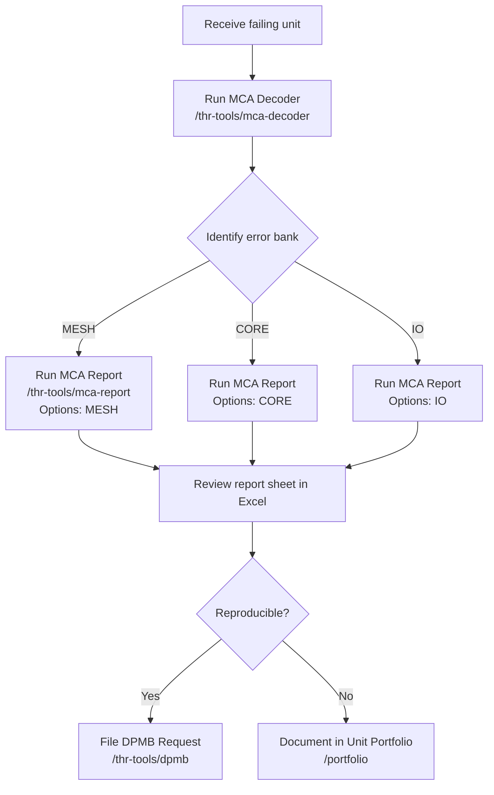
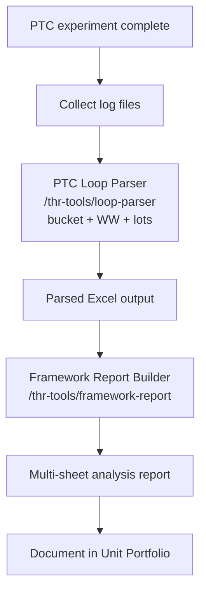
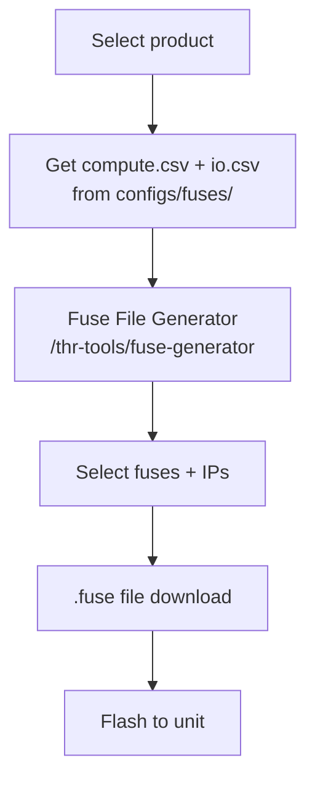
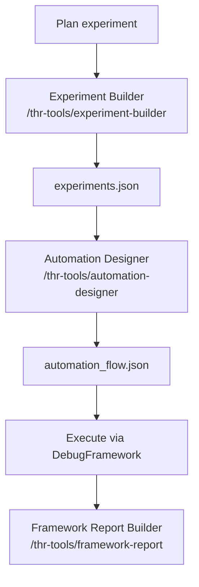
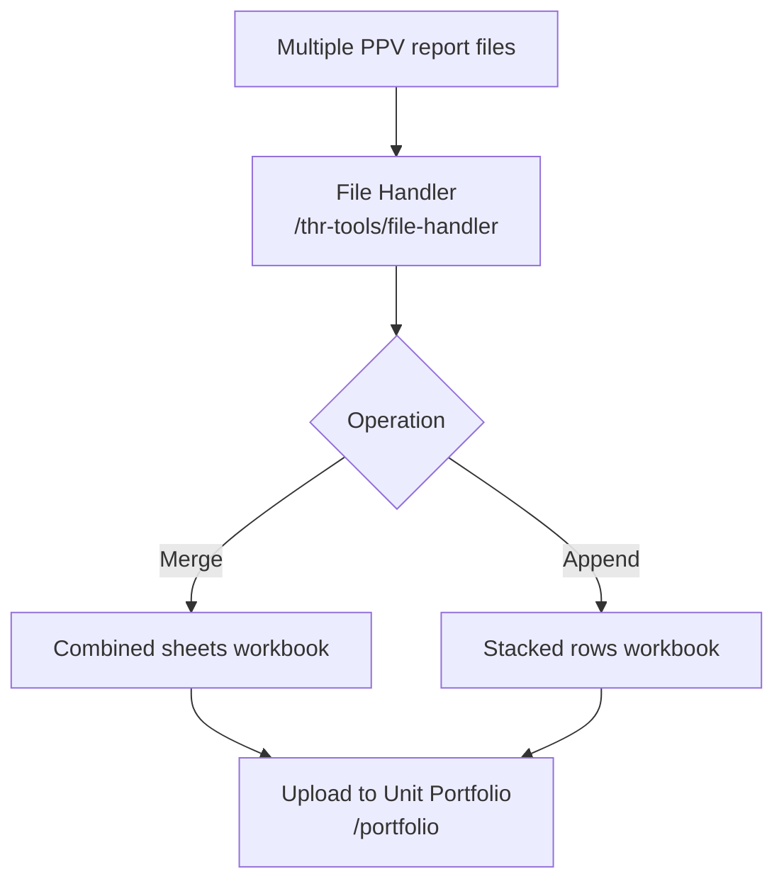

# THR Tools Debug Workflows

## Overview

Common end-to-end debug workflows using the Portfolio tools.

---

## Workflow 1: MCA Failure Analysis

---

## Workflow 2: PTC Experiment Loop Analysis

---

## Workflow 3: Fuse Configuration

---

## Workflow 4: Experiment Design & Automation

---

## Workflow 5: File Consolidation

---

## Notes

- All tools use file upload/download — no direct filesystem writes from the browser
- DPMB requests require network access to the DPMB service
- Framework Report accepts missing DataFrames (empty substituted with a warning)
