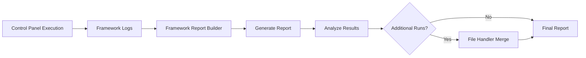
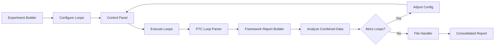
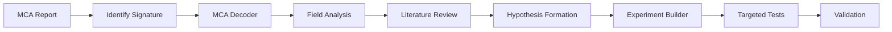

# THR Debug Tools - Workflow & Integration Flows

**Version:** 2.0
**Release Date:** January 15, 2026
**Organization:** Intel Corporation - Test & Validation
**Classification:** Intel Confidential
**Maintainer:** Gabriel Espinoza (gabriel.espinoza.ballestero@intel.com)
**Repository:** `c:\Git\Automation\PPV\`
**Documentation:** `c:\Git\Automation\S2T\DOCUMENTATION\`

---

## Overview

This document describes the complete workflows and tool integrations within the THR Debug Tools suite. Each workflow represents a common debug scenario, showing how tools interconnect to provide comprehensive analysis capabilities.

---

## Table of Contents

1. [Primary Debug Workflows](#primary-debug-workflows)
2. [Tool Integration Matrix](#tool-integration-matrix)
3. [Data Flow Diagrams](#data-flow-diagrams)
4. [Workflow Examples](#workflow-examples)
5. [Best Practices](#best-practices)

---

## Primary Debug Workflows

### Workflow 1: Offline Characterization Planning

**Purpose:** Analyze historical data to plan targeted characterization experiments

**Scenario:** Unit showing intermittent failures in production; need to design offline characterization strategy


#### Steps

**Step 1: DPMB Bucketer Request**
- Launch DPMB tool from THR Hub
- Input Visual ID(s) for unit(s) of interest
- Set time range (e.g., WW40-WW45)
- Select product (GNR/CWF/DMR)
- Choose relevant operations (8749, 8748, 8657, etc.)
- Submit request to download historical bucket data
- Export results to JSON/Excel

**Output:** Historical bucket data with test results, postcodes, MCA errors

**Step 2: MCA Report Builder**
- Launch MCA Report Builder
- Select Mode: `Bucketer`
- Load Bucketer export file from Step 1
- Select product and work week
- Add custom label (e.g., "Offline_Analysis_WW45")
- Generate MCA report

**Output:** Comprehensive MCA report with error patterns, decoder analysis, timeline

**Step 3: MCA Analysis**
- Review MCA Report sections:
  - Summary: Overall error statistics
  - Decoder Analysis: Breakdown by CHA/LLC/CORE/MEM/IO
  - Bank Distribution: Spatial error distribution
  - Timeline: Temporal patterns
- Identify recurring MCA signatures
- Note specific register values for deep analysis

**Key Questions:**
- Which decoder types show highest error rates?
- Are errors concentrated in specific banks/cores?
- Are errors temporal (time-based) or spatial (location-based)?
- What postcodes correlate with MCA errors?

**Step 4: MCA Deep Dive Decode**
- Launch MCA Single Line Decoder
- Select appropriate decoder type (CHA/LLC/CORE/etc.)
- Input specific register values from MCA Report
- Decode to understand microarchitectural details
- Document findings

**Output:** Detailed field-level decode showing error type, transaction type, address info, cache state

**Step 5: Experiment Design**
- Launch Experiment Builder
- Select product template
- Create targeted experiments based on MCA findings:
  - **For LLC errors:** Configure cache-heavy workloads
  - **For CORE errors:** Target specific core types (ML2/DCU/IFU)
  - **For MEMORY errors:** Configure memory stress tests
  - **For IO errors:** Configure interconnect tests
- Set experiment parameters:
  - Test names reflecting target (e.g., "LLC_Error_Repro_001")
  - Loop counts for statistical confidence
  - Content type matching failure scenario
  - Postcodes from historical failures
- Configure advanced settings:
  - Mask values for feature isolation
  - Defeature flags for workaround testing
  - Expected failing content for automated detection

**Output:** JSON configuration file for Control Panel

**Step 6: Export for Execution**
- Save experiment configuration as JSON
- Validate JSON structure
- Document experiment plan in comments
- Archive experiment file with naming convention: `{Product}_{Purpose}_{Date}.json`

**Output:** Ready-to-execute experiment file

**Step 7: Control Panel Execution** (External Tool)
- Load JSON configuration into Control Panel
- Execute experiments
- Monitor real-time execution
- Collect data to Framework server

**Step 8: Post-Execution Analysis** (See Workflow 2)

---

### Workflow 2: Post-Execution Framework Analysis

**Purpose:** Analyze Debug Framework execution results and generate comprehensive reports

**Scenario:** Experiments completed on Control Panel; need detailed analysis of results



#### Steps

**Step 1: Framework Report Builder**
- Launch Framework Report Builder from THR Hub
- Select product (GNR/CWF/DMR)
- Choose Visual ID from dropdown (auto-populated from network server)
  - Data source: `\\crcv03a-cifs.cr.intel.com\mfg_tlo_001\DebugFramework\{Product}\{Visual_ID}\`
- Select save folder for output report

**Step 2: Experiment Configuration**
- Review experiment list (middle panel)
- For each experiment, configure:
  - **Type:** Categorize experiment
    - `Baseline`: Baseline characterization
    - `Loops`: Repetitive loop testing
    - `Voltage`: Voltage sweep/shmoo
    - `Frequency`: Frequency sweep
    - `Shmoo`: Multi-dimensional characterization
    - `Invalid`: Corrupted/incomplete data
    - `Others`: Uncategorized
  - **Content:** Test content used
    - `DBM`: Dragon Bootloader Module
    - `Pseudo Slice`: Pseudo slice tests
    - `Pseudo Mesh`: Pseudo mesh tests
    - `TSL`: Test Sequence Language
    - `Sandstone`: Sandstone workload
    - `Imunch`: Imunch stress test
    - `EFI`: EFI shell content
    - `Python`: Python-based tests
    - `Linux`: Linux OS tests
    - `Other`: Other content types
  - **Include:** Enable/disable in report
  - **Custom:** Custom identifier/version
  - **Comments:** Additional notes

**Step 3: Report Options**
- Configure right panel options:
  - **Skip Invalid:** Auto-exclude Invalid experiments
  - **VVAR Options:** Enable VVAR parsing for Dragon content (DBM, Pseudo Slice/Mesh)
  - **Core Data:** Enable per-core voltage/ratio extraction
  - **MCA Integration:** Include MCA error data in report

**Step 4: Generate Report**
- Click **Generate Report**
- Parser processes Framework logs:
  - Extracts experiment data
  - Parses VVAR information (if enabled)
  - Extracts core voltages/ratios (if enabled)
  - Integrates MCA errors (if enabled)
  - Categorizes failing content
  - Identifies unique failure patterns
  - Generates experiment summary
- Progress displayed in status bar

**Output:** Excel report with 8 worksheets:
1. **FrameworkData**: Raw iteration data (all test iterations)
2. **ExperimentReport**: Polished summary (key metrics per experiment)
3. **DragonData**: VVAR analysis (for Dragon content only)
4. **CoreData**: Per-core voltage/ratio/VVAR data
5. **FrameworkFails**: Failing content categorization (EFI/Linux/Python)
6. **UniqueFails**: Unique failing patterns identified
7. **MCA**: Machine Check Architecture errors
8. **Summary**: Experiment-level comprehensive summary

**Step 5: Report Analysis**
- **ExperimentReport Tab:** High-level experiment overview
  - Experiment status (Pass/Fail)
  - Fail rates
  - Postcodes hit
  - Configuration details
  - Used content
- **FrameworkData Tab:** Detailed iteration analysis
  - Individual iteration results
  - Timing information
  - Postcodes per iteration
  - Iteration-level failures
- **DragonData Tab:** VVAR patterns (if applicable)
  - Voltage/ratio combinations
  - VVAR occurrence frequency
  - Correlation with failures
- **CoreData Tab:** Core-specific analysis
  - Per-core voltages
  - Per-core ratios
  - Per-core VVARs
  - Core-to-core variations
- **FrameworkFails Tab:** Failure categorization
  - EFI failures (DBM, Pseudo Slice/Mesh, EFI content)
  - Linux failures (TSL, Sandstone, Linux content)
  - Python failures (Python scripts)
  - Failing content strings
- **UniqueFails Tab:** Unique patterns
  - Deduplicated failing signatures
  - Occurrence counts
  - Associated experiments
- **MCA Tab:** MCA error integration
  - MCA errors correlated with experiments
  - Decoder type distribution
  - Register values
- **Summary Tab:** Experiment-level summary
  - One row per experiment
  - Key characterization metrics
  - Status summary
  - VVAR summary
  - Core data summary
  - Failing content summary

**Step 6: Multi-Run Consolidation** (Optional)
- If multiple execution runs exist:
  - Launch File Handler
  - Select Mode: `Merge`
  - Choose source folder containing multiple reports
  - Set target file for merged output
  - (Optional) Set file prefix filter (e.g., "FrameworkReport_")
  - Execute merge
  - Review consolidated report

**Output:** Unified report across multiple Framework executions

---

### Workflow 3: Loop Characterization Campaign

**Purpose:** Execute, parse, and analyze repetitive loop testing for failure characterization

**Scenario:** Characterizing intermittent failures through extensive loop testing



#### Steps

**Step 1: Loop Experiment Design**
- Launch Experiment Builder
- Configure loop experiments:
  - Test Type: `Loops`
  - Loop count: 1000-10000 (based on failure rate)
  - Content: Match target scenario
  - Pass/Fail strings
  - Postcodes
  - Timeout values

**Step 2: Control Panel Execution**
- Load experiment JSON to Control Panel
- Execute loop runs
- Monitor for failures
- Collect PTC (Post-Test Check) data

**Step 3: PTC Loop Parsing**
- Launch PTC Loop Parser
- Configure parameters:
  - **Bucket:** Loop campaign identifier (e.g., `PPV_Loops_WW45`)
  - **Week:** Current work week
  - **Sequence Key:** Loop sequence identifier (default 100)
  - **Loops Folder:** Path to Framework loop data
  - **Output File:** Excel report path
- Enable ZIP processing if data is compressed
- Execute parse

**Output:** Excel report with:
- Loop iteration summaries
- Pass/Fail statistics per loop
- PostCode distribution
- Timing analysis
- Sequence-based organization

**Step 4: Framework Detailed Analysis**
- Launch Framework Report Builder
- Load same Visual ID
- Configure experiments as loop type
- Enable VVAR and Core Data options
- Generate comprehensive report

**Output:** Detailed Framework report with per-iteration data

**Step 5: Combined Analysis**
- Cross-reference PTC Loop report with Framework report:
  - **Loop Report:** High-level loop metrics, sequence organization
  - **Framework Report:** Detailed per-iteration data, MCA, VVARs, core data
- Identify patterns:
  - Loop-to-loop variation
  - Temporal failure patterns
  - VVAR correlations
  - Core-specific failures

**Step 6: Iteration Decision**
- **If failures not characterized:**
  - Adjust loop parameters
  - Increase loop counts
  - Modify test configurations
  - Return to Step 1
- **If failures characterized:**
  - Proceed to consolidation

**Step 7: Multi-Week Consolidation**
- Launch File Handler
- Mode: `Merge`
- Source: Folder with weekly loop reports
- Target: Consolidated monthly/campaign report
- File Prefix: "Loop_Report_"
- Execute merge

**Output:** Unified loop campaign report across multiple weeks/runs

---

### Workflow 4: Automation Flow Design & Execution

**Purpose:** Design complex multi-experiment automation flows with decision trees

**Scenario:** Need adaptive characterization flow that branches based on real-time results


#### Steps

**Step 1: Base Experiment Creation**
- Launch Experiment Builder
- Create experiment library:
  - Baseline experiments (known-good configs)
  - Characterization experiments (targeted tests)
  - Stress experiments (high-stress conditions)
  - Diagnostic experiments (specific feature tests)
- Export experiments as JSON or Excel

**Step 2: Automation Flow Design**
- Launch Automation Flow Designer
- Load experiment library (from Step 1)
- Design flow on canvas:

**Flow Example: Adaptive Voltage Characterization**
```
START
  ↓
[Baseline_Check] (SingleFailFlowInstance)
  ├─ PASS → [Voltage_Sweep_1] (CharacterizationFlowInstance)
  │           ├─ PASS → [Voltage_Sweep_2] (Extended range)
  │           │           ├─ PASS → [Data_Collection] (DataCollectionFlowInstance)
  │           │           │           └─ END
  │           │           └─ FAIL → [Analysis_1] (AnalysisFlowInstance)
  │           │                       └─ END
  │           └─ FAIL → [Diagnostic_1] (Targeted diagnostic)
  │                       ├─ PASS → [Voltage_Sweep_2]
  │                       └─ FAIL → [Deep_Dive] (CharacterizationFlowInstance)
  │                                   └─ END
  └─ FAIL → [Baseline_Repro] (AllFailFlowInstance)
              ├─ PASS → END (Intermittent failure)
              └─ FAIL → [Root_Cause] (Deep diagnostic)
                          └─ END
```

**Step 3: Node Configuration**
- For each node, configure properties:

**SingleFailFlowInstance:**
- Experiment: Select from library
- Max Iterations: 100
- Pass Branch: Next characterization node
- Fail Branch: Diagnostic node

**CharacterizationFlowInstance:**
- Test Phases: Multiple test configurations
- Phase Ordering: Sequential or parallel
- Failure Handling: Continue or abort

**AdaptiveFlowInstance:**
- Base Experiment: Starting point
- Adaptation Rules: Parameter adjustment logic
- Parameter Ranges: Min/max boundaries

**DataCollectionFlowInstance:**
- Collection Parameters: Data points to capture
- Data Points: Specific metrics
- Storage Configuration: Output paths

**AnalysisFlowInstance:**
- Analysis Types: MCA, VVAR, Core Data
- Decision Rules: Branch conditions
- Branching Logic: Next node determination

**Step 4: Unit Configuration Override**
- Set unit-specific overrides (optional):
  - Visual ID: Override target unit
  - Bucket: Override bucket assignment
  - COM Port: Override serial port
  - IP Address: Override network address
  - 600W Unit: Flag for high-power requirements
  - Check Core: Specific cores to monitor

**Step 5: Flow Validation**
- Review flow structure:
  - Verify all nodes connected
  - Check for orphaned nodes
  - Validate branch logic
  - Ensure END nodes reachable
- Test with sample data (if available)

**Step 6: Export Flow**
- Click **Export Flow**
- Save as JSON file
- Naming convention: `{Product}_AutoFlow_{Purpose}_{Date}.json`
- Document flow purpose in file comments

**Output:** JSON file with:
- `flow_nodes`: Node definitions with experiments and parameters
- `flow_structure`: Node connections and branch logic
- `unit_config`: Unit override configurations

**Step 7: Control Panel Automation**
- Load flow JSON into Control Panel
- Control Panel interprets flow structure
- Executes experiments adaptively based on results
- Real-time branching decisions
- Logs execution path

**Step 8: Post-Execution Analysis**
- Launch Framework Report Builder
- Analyze execution path:
  - Which branches taken?
  - Where did characterization terminate?
  - What patterns triggered branches?
- Review results using Workflow 2

---

### Workflow 5: MCA Deep Dive Investigation

**Purpose:** Detailed investigation of specific MCA error signatures

**Scenario:** Recurring MCA error signature requires microarchitectural understanding



#### Steps

**Step 1: MCA Report Generation**
- Use Workflow 1 or 2 to generate MCA Report
- Identify recurring MCA signature:
  - MC_STATUS value
  - MC_ADDR patterns
  - MC_MISC data
  - Associated postcodes
  - Correlation with experiments

**Step 2: Single Line Decode**
- Launch MCA Single Line Decoder
- Select product and decoder type
- Input register values
- Decode all registers

**Example:**
```
Input:
  Decoder: CHA/CCF
  Product: GNR
  MC_STATUS: 0xBEA00000000C0151
  MC_ADDR: 0x000000FF12345678
  MC_MISC: 0x0000000000000086

Output:
  Error Type: Data Read Error
  Request: RFO (Read For Ownership)
  Source: Remote socket
  Physical Address: 0x00FF12345678
  Cache State: Modified
  Severity: Corrected
```

**Step 3: Field-Level Analysis**
- Analyze decoded fields:
  - **Error Type:** What failed? (Data read, instruction fetch, etc.)
  - **Request Type:** What caused error? (RFO, demand read, prefetch)
  - **Source:** Where originated? (Local core, remote socket, IO)
  - **Address:** Physical memory location or IO address
  - **Cache State:** Cache line state (Modified, Exclusive, Shared, Invalid)
  - **Severity:** Corrected vs. Uncorrected

**Step 4: Microarchitecture Research**
- Cross-reference with architecture documentation:
  - CHA transaction flows
  - LLC organization
  - Memory topology
  - Coherency protocol
- Understand failure mechanism

**Step 5: Hypothesis Formation**
- Develop testable hypotheses:
  - "MCA occurs under high remote socket traffic"
  - "Error triggered by specific address range"
  - "Failure correlates with cache line state transitions"
  - "Temperature/voltage dependent"

**Step 6: Targeted Experiment Design**
- Launch Experiment Builder
- Design experiments to test hypotheses:
  - Configure workloads targeting specific scenarios
  - Set address ranges (if address-specific)
  - Configure socket affinity (if socket-specific)
  - Set voltage/frequency points (if environmental)
  - Enable detailed logging

**Step 7: Execution & Validation**
- Execute targeted experiments
- Monitor for MCA reproduction
- Collect detailed logs
- Validate hypothesis

**Step 8: Iteration**
- If hypothesis confirmed: Document root cause
- If hypothesis rejected: Return to Step 4 with new insights

---

## Tool Integration Matrix

| Source Tool | Output | Destination Tool(s) | Input Type |
|-------------|--------|---------------------|------------|
| **DPMB Request** | JSON/Excel bucket data | MCA Report Builder | Bucketer file |
| | | Experiment Builder | Reference data |
| **MCA Report Builder** | Excel MCA report | MCA Decoder | Register values |
| | | Framework Report Builder | MCA correlation |
| **MCA Decoder** | Decoded register fields | Documentation | Analysis notes |
| **Experiment Builder** | JSON config | Automation Designer | Experiment library |
| | | Control Panel | Direct execution |
| **Automation Designer** | Flow JSON | Control Panel | Automation flow |
| **Control Panel** | Framework logs | Framework Report Builder | Execution data |
| | | PTC Loop Parser | Loop data |
| **Framework Report Builder** | Excel report | File Handler | Merge source |
| | | Analysis tools | Reference data |
| **PTC Loop Parser** | Excel loop report | File Handler | Merge source |
| | | Analysis tools | Reference data |
| **File Handler** | Merged Excel report | Analysis tools | Consolidated data |

---

## Data Flow Diagrams

### Complete Debug Cycle Data Flow

```
[DPMB Server]
     ↓ (API Request)
[DPMB Request Tool]
     ↓ (JSON/Excel)
[MCA Report Builder] ← (Bucketer Mode)
     ↓ (Excel Report)
[MCA Decoder] ← (Register Values)
     ↓ (Analysis)
[Experiment Builder] ← (Test Config)
     ↓ (JSON)
[Automation Designer] ← (Experiment Library)
     ↓ (Flow JSON)
[Control Panel] ← (Automation)
     ↓ (Execution)
[Framework Server] ← (Log Storage)
     ↓ (Network Path)
[Framework Report Builder] ← (Parse Logs)
     ↓ (Excel Reports)
[File Handler] ← (Merge Multiple)
     ↓ (Consolidated Report)
[Analysis & Documentation]
```

### Loop Campaign Data Flow

```
[Experiment Builder]
     ↓ (JSON Config)
[Control Panel]
     ↓ (Execute Loops)
[Framework Server]
     ├─ (Loop Data) → [PTC Loop Parser]
     │                      ↓
     │                 [Loop Excel Report]
     │                      ↓
     └─ (Framework Logs) → [Framework Report Builder]
                                 ↓
                            [Framework Excel Report]
                                 ↓
     ┌──────────────────────────┴──────────────────────┐
     ↓                                                  ↓
[PTC Loop Report]                          [Framework Detail Report]
     ↓                                                  ↓
     └────────────────┬─────────────────────────────────┘
                      ↓
                [File Handler]
                      ↓
              [Consolidated Report]
```

---

## Workflow Examples

### Example 1: DMR Unit Characterization

**Objective:** Characterize DMR unit with intermittent MCA errors

**Timeline:** 3 days

**Day 1: Data Collection & Analysis**
1. DPMB Request: Download WW40-WW45 data for unit VID
2. MCA Report Builder: Generate MCA report from Bucketer data
3. Analysis: Identify LLC MCA errors concentrated in Slice 2
4. MCA Decoder: Decode sample LLC errors
5. Findings: Way 4 showing repeated corrected errors

**Day 2: Experiment Design & Execution**
1. Experiment Builder: Create targeted LLC stress tests
   - Focus on Slice 2
   - Configure cache-heavy workloads
   - 1000 loop iterations
2. Control Panel: Execute experiments
3. Initial results: 15% failure rate on LLC stress

**Day 3: Deep Characterization**
1. Framework Report Builder: Analyze execution logs
2. Review CoreData: Identify voltage correlation
3. Experiment Builder: Design voltage sweep experiments
4. Automation Designer: Create adaptive flow
   - Start with baseline
   - If fail: Voltage sweep
   - If pass: Extended stress
5. Control Panel: Execute automation flow
6. Framework Report Builder: Final analysis
7. File Handler: Merge all reports
8. Documentation: Root cause identified (voltage-dependent LLC issue)

---

### Example 2: GNR Automation Campaign

**Objective:** Develop reusable automation flow for GNR quick characterization

**Timeline:** 5 days

**Day 1-2: Experiment Library Creation**
1. Experiment Builder: Create 20 base experiments
   - 5 Baseline tests
   - 5 Voltage sweeps
   - 5 Frequency sweeps
   - 5 Diagnostic tests
2. Validation: Execute individually, verify functionality
3. Documentation: Document expected behavior per experiment

**Day 3: Flow Design**
1. Automation Designer: Design multi-phase flow
   ```
   Phase 1: Baseline Check (SingleFailFlowInstance)
   Phase 2: Quick Characterization (CharacterizationFlowInstance)
   Phase 3: Targeted Stress (AdaptiveFlowInstance)
   Phase 4: Data Collection (DataCollectionFlowInstance)
   Phase 5: Analysis (AnalysisFlowInstance)
   ```
2. Configure branch logic:
   - Pass/Fail routing
   - Adaptive parameter adjustment
   - Data collection triggers
3. Unit override configuration for flexibility

**Day 4: Validation**
1. Control Panel: Execute flow on validation unit
2. Monitor real-time execution path
3. Framework Report Builder: Analyze results
4. Iterate flow design based on findings

**Day 5: Production & Documentation**
1. Finalize flow JSON
2. Create execution guide
3. Archive to repository
4. Train team on usage

**Outcome:** Reusable 5-phase GNR characterization flow reducing manual effort by 70%

---

## Best Practices

### Planning Phase
- **Start with data:** Always review historical DPMB data before planning experiments
- **Hypothesis-driven:** Form clear hypotheses before experiment design
- **Document assumptions:** Record assumptions in experiment comments

### Experiment Design
- **Incremental complexity:** Start simple, add complexity incrementally
- **Statistical confidence:** Use sufficient loop counts for statistical significance
- **Control experiments:** Include baseline/control experiments for comparison
- **Naming conventions:** Use clear, descriptive experiment names

### Execution
- **Monitor real-time:** Watch initial iterations to catch configuration errors early
- **Log everything:** Enable comprehensive logging
- **Checkpoint progress:** Save intermediate results

### Analysis
- **Multi-tool correlation:** Use multiple tools to cross-validate findings
- **Look for patterns:** Temporal, spatial, environmental patterns
- **Document unknowns:** Note uncertainties for future investigation

### Collaboration
- **Share flows:** Version control automation flows for team reuse
- **Standardize reports:** Use consistent report naming and organization
- **Archive data:** Maintain raw data separately from processed reports

### Tool Selection
| Scenario | Primary Tool | Supporting Tools |
|----------|--------------|------------------|
| Historical analysis | DPMB Request | MCA Report Builder, MCA Decoder |
| Framework analysis | Framework Report Builder | File Handler |
| Loop characterization | PTC Loop Parser | Framework Report Builder |
| Experiment creation | Experiment Builder | Automation Designer |
| Complex automation | Automation Designer | Experiment Builder, Control Panel |
| MCA investigation | MCA Decoder | MCA Report Builder |
| Report consolidation | File Handler | All report generators |

---

## Advanced Integration Patterns

### Pattern 1: Continuous Monitoring

**Use Case:** Weekly automated characterization with trend analysis

**Implementation:**
1. Schedule weekly DPMB requests for fleet units
2. Automated MCA Report generation
3. File Handler merges weekly reports monthly
4. Trend analysis on consolidated data
5. Alert on anomaly detection

### Pattern 2: Adaptive Characterization

**Use Case:** Unit-specific characterization adjusting to real-time results

**Implementation:**
1. Baseline assessment experiments
2. AdaptiveFlowInstance with parameter adjustment
3. Real-time branching based on results
4. Experiment library expansion as needed
5. Flow modification between iterations

### Pattern 3: Root Cause Isolation

**Use Case:** Systematic root cause identification through elimination

**Implementation:**
1. Reproduce failure with baseline experiment
2. AllFailFlowInstance confirms systematic failure
3. CharacterizationFlowInstance with feature isolation:
   - Mask different features
   - Defeature specific units
   - Isolate failure domain
4. Targeted experiments on isolated domain
5. Validation with DataCollectionFlowInstance

---

## Troubleshooting Workflows

### Issue: Automation Flow Doesn't Branch Correctly

**Debug Workflow:**
1. Framework Report Builder: Analyze execution logs
2. Review experiment results per iteration
3. Check pass/fail detection logic:
   - Verify Pass String configuration
   - Verify Fail String configuration
   - Check postcode expectations
4. Automation Designer: Review branch conditions
5. Adjust flow logic and re-export
6. Re-execute with verbose logging

### Issue: MCA Errors Not Captured in Reports

**Debug Workflow:**
1. Framework Report Builder: Verify MCA Integration enabled
2. Check source logs for MCA presence:
   - Framework server path accessible?
   - Logs complete?
3. MCA Report Builder: Generate standalone MCA report
4. Compare standalone vs. integrated results
5. Verify decoder types match product

### Issue: Loop Data Parsing Incomplete

**Debug Workflow:**
1. PTC Loop Parser: Verify folder path correct
2. Check folder structure:
   - Expected loop data present?
   - ZIP files if ZIP mode enabled?
3. Verify sequence key matches data organization
4. Review bucket/week naming conventions
5. Re-parse with corrected parameters

---

## Appendix: Flow Templates

### Template 1: Quick Characterization Flow

```json
{
  "flow_nodes": {
    "START": {"type": "StartNode"},
    "baseline": {
      "type": "SingleFailFlowInstance",
      "experiment": "Baseline_Check",
      "max_iterations": 10
    },
    "voltage_sweep": {
      "type": "CharacterizationFlowInstance",
      "experiments": ["Voltage_0.8V", "Voltage_0.9V", "Voltage_1.0V", "Voltage_1.1V"]
    },
    "END": {"type": "EndNode"}
  },
  "flow_structure": {
    "START": {"next": "baseline"},
    "baseline": {"Pass": "voltage_sweep", "Fail": "END"},
    "voltage_sweep": {"Pass": "END", "Fail": "END"}
  }
}
```

### Template 2: Comprehensive Characterization Flow

```json
{
  "flow_nodes": {
    "START": {"type": "StartNode"},
    "baseline": {
      "type": "AllFailFlowInstance",
      "experiment": "Baseline_Full",
      "iteration_count": 100,
      "consecutive_fail_threshold": 95
    },
    "quick_char": {
      "type": "CharacterizationFlowInstance",
      "experiments": ["Voltage_Nominal", "Frequency_Nominal", "Cache_Stress"]
    },
    "adaptive_stress": {
      "type": "AdaptiveFlowInstance",
      "base_experiment": "Adaptive_Voltage",
      "adaptation_rules": "voltage_adjustment",
      "parameter_range": {"voltage": [0.7, 1.2]}
    },
    "data_collection": {
      "type": "DataCollectionFlowInstance",
      "collection_parameters": ["VVAR", "CoreData", "MCA"],
      "iterations": 1000
    },
    "END": {"type": "EndNode"}
  },
  "flow_structure": {
    "START": {"next": "baseline"},
    "baseline": {"Pass": "quick_char", "Fail": "END"},
    "quick_char": {"Pass": "adaptive_stress", "Fail": "data_collection"},
    "adaptive_stress": {"Pass": "data_collection", "Fail": "data_collection"},
    "data_collection": {"Pass": "END", "Fail": "END"}
  }
}
```

---

## Summary

The THR Debug Tools suite provides comprehensive workflows for:
- **Offline Planning:** Historical data analysis and experiment design
- **Online Debug:** Real-time unit characterization and failure analysis
- **Automated Characterization:** End-to-end experiment execution
- **Report Generation:** Multi-source MCA analysis and reporting
- **Data Management:** File operations, consolidation, and organization

**Key Capabilities:**
- 8 integrated GUI tools for complete debug coverage
- Seamless tool-to-tool data flow
- DPMB API integration for historical context
- Product-specific MCA decoding (GNR/CWF/DMR)
- Framework automation with Experiment Builder
- Comprehensive report generation

---

## 📧 Support

**Maintainer:** Gabriel Espinoza
**Email:** gabriel.espinoza.ballestero@intel.com
**Organization:** Intel Corporation - Test & Validation
**Version:** 2.0
**Release Date:** January 15, 2026

**Related Documentation:**
- Quick Start: [THR_DEBUG_TOOLS_QUICK_START.md](THR_DEBUG_TOOLS_QUICK_START.md)
- User Manual: [THR_DEBUG_TOOLS_USER_MANUAL.md](THR_DEBUG_TOOLS_USER_MANUAL.md)
- Examples: [THR_DEBUG_TOOLS_EXAMPLES.ipynb](THR_DEBUG_TOOLS_EXAMPLES.ipynb)
- All Documentation: [../README.md](THR_DOCUMENTATION_README.md)

**Repository:** `c:\Git\Automation\PPV\`
**Documentation:** `c:\Git\Automation\S2T\DOCUMENTATION\`

---

**© 2026 Intel Corporation. Intel Confidential.**
- **Execution:** Automated and manual test execution
- **Analysis:** Multi-dimensional data analysis and reporting
- **Iteration:** Continuous improvement through adaptive workflows
- **Collaboration:** Standardized reports and shareable automation flows

By following these workflows and integration patterns, engineers can efficiently characterize units, identify root causes, and document findings with minimal manual effort.

**Version:** 2.0
**Last Updated:** January 2025
